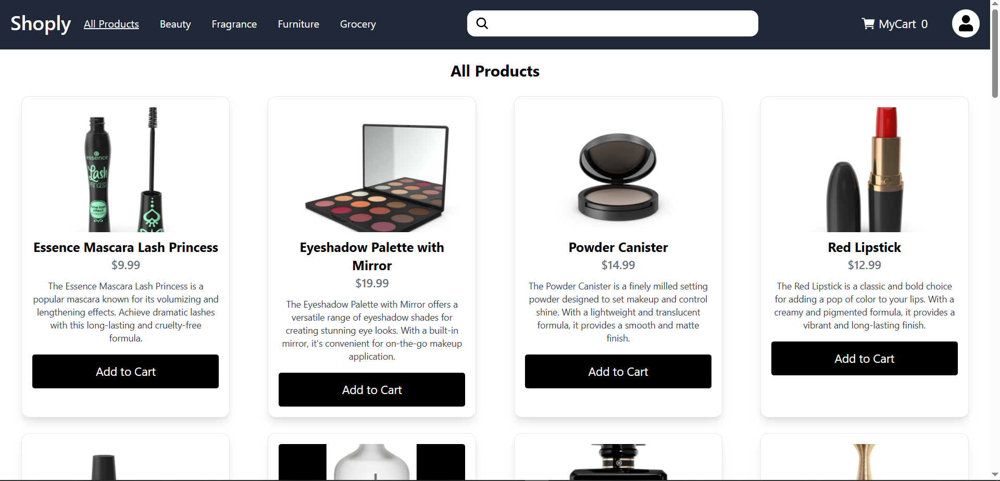
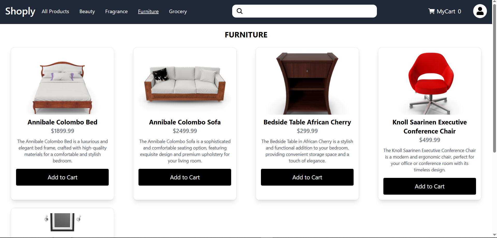
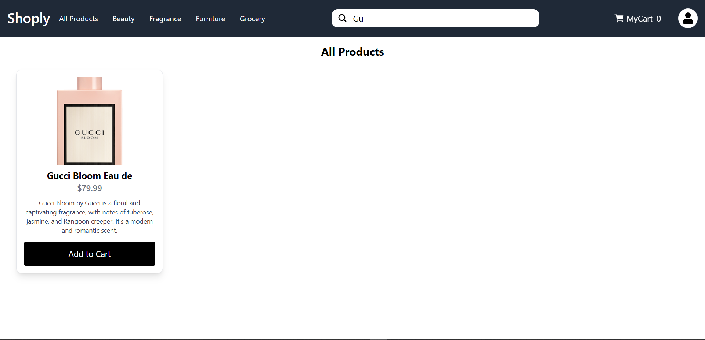
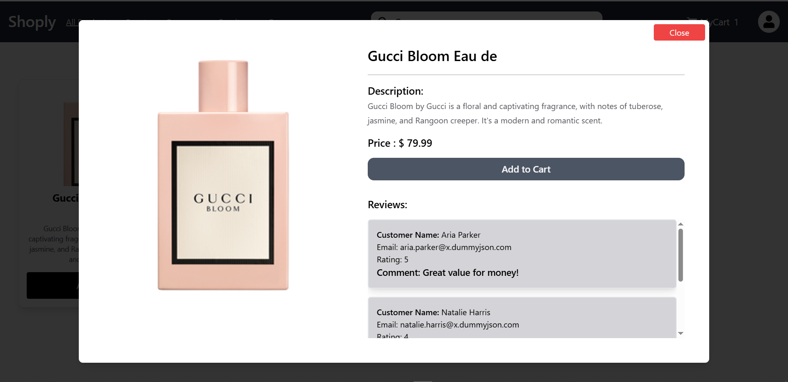
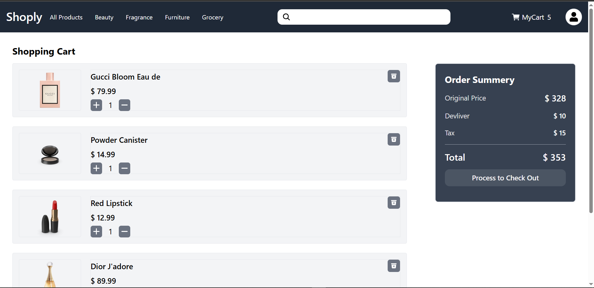

# E-Commerce  Store Frontend

# Live Demo - https://ecom-assignment-puce.vercel.app/

## How to run the project
1. First you need to clone the project with and go to directory
	```
	> git clone https://github.com/sahilpatil-009/ecom-assignment.git
	> cd ecom-assignment
	```
3. Then you need to install the dependencies with
	```
	> npm install
	```
4. Then you need to start the server with 
	```
	> npm run dev
	```

Then it will run the project at localhost

# Screenshots





